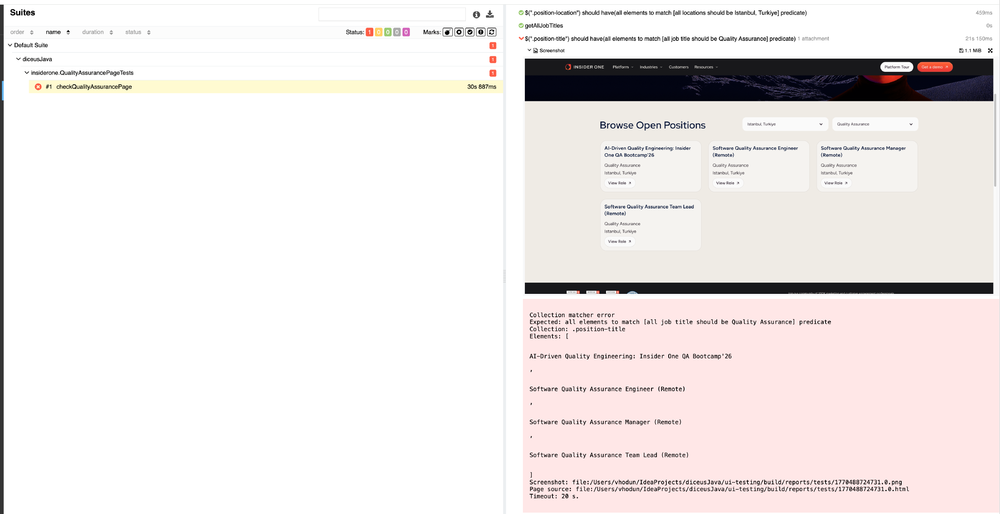

# Test Automation Framework

Multi-module test automation framework for comprehensive testing: API, UI, and Performance testing.


## Tech Stack

- **Java** - Primary programming language
- **Spring Boot** - Application framework
- **Selenide** - UI testing framework
- **REST Assured** - API testing
- **Maven** - Build tools
- **TestNG** - Test runners

### Supported Browsers
- `chrome` (default)
- `firefox`

To change browser, modify `browser.name` in `application.properties`

---

## Running Tests

**Run Parameters:**

```bash
-ea -Denv=dev -Dtarget=microservices_dev
```

**Running API/UI Tests:**
```bash
mvn clean test -ea -Denv=dev -Dtarget=microservices_dev
```

**Running Performance Tests:**
```bash
mvn gatling:test
```

### Allure Reports

**Generate Allure Report:**

```bash
allure serve allure-results
```

**Report Example:**


